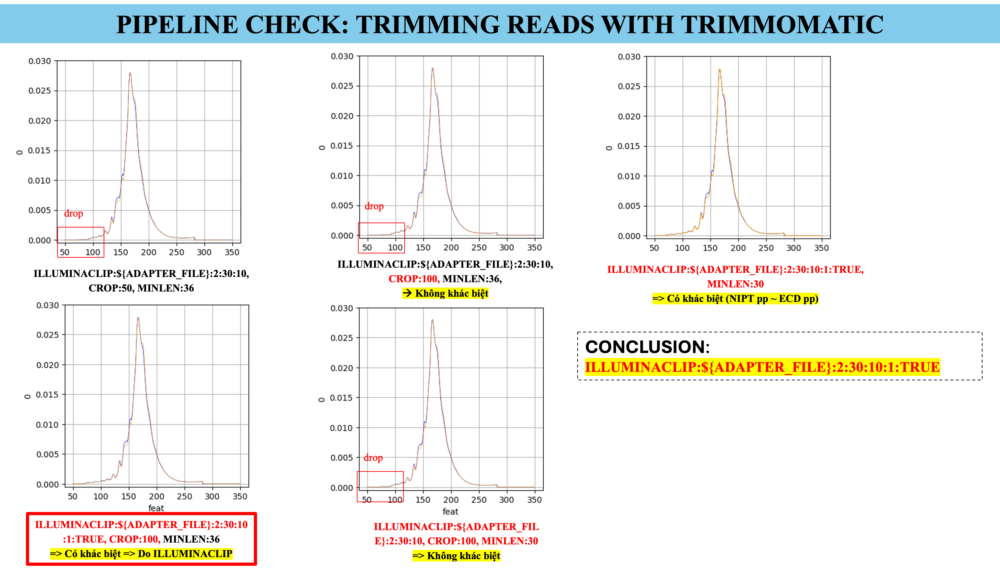
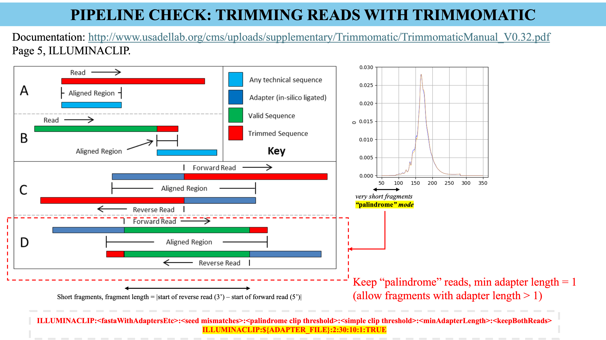

# Update 14.05.2025

- [ ]  Chuyển từ CROP 50 sang CROP 100 để trả lại đúng độ dài của reads, ngoài ra thêm option ILLUMINA CLIP TRUE để giữ lại các short DNA fragments, xem 2 hình sau để hiểu
    
    
    
    Thử nhiều option cho CROP và ILLUMINA CLIP khác nhau, plot fragment length distribution để xem các short DNA fragments có giữ lại được trong data hay không.
    

Mô tả nguyên nhân tại sao các short fragments bị mất đi nếu như không có option ILLUMINA CLIP TRUE, các reads này là palindrom reads. 

Xem pipeline diagrame trong file “20250514_ECD_feature_pipeline_review_and_update.pptx” trên one drive

[pipeline diagram](https://1drv.ms/p/c/75ebfdc2fbaab1da/EeI7YXhRajZHmuaS9lKyDnABCPKGyB8FJBB1ZVg8XLVCjQ?e=Ptv7pu)

- [ ]  Chạy pipeline bioinformatics với trimming options CROP 100 và ILLUMINA CLIP TRUE.
- [ ]  Download the latest `picard` at https://github.com/broadinstitute/picard/releases/tag/3.4.0 
- [ ]  Bỏ scripts “preprocessing_script.awk”.
- [ ]  Loại toàn bộ các chromosome lạ và chromosome giới tính trong bước convert file `BAM` thành file `.frag.tsv.` Chỉ giữ lại chromosome 1-22.Đem điều kiện `TLEN != 0` vào trong lúc tạo file này luôn.
- [ ]  Các lệnh `paste` trong lúc gộp features file trong 1 lệnh duy nhất để tối ưu IO.
- [ ]  dùng `parquet` thay cho lưu file bằng `.csv` để tăng tốc và tối ưu IO.
- [ ]  Markdup trong lúc chạy phần **(1) Bioinformatics pipeline,** dùng file `.markdup.bam` làm input cho phần pipeline **(2) WGS-feature pipeline** lúc sau. Thống nhất, không sử dụng 2 file `BAM` khác nhau gây khó hiểu.
- [ ]  Các end motif có thể đang ở dạng UPPER CASE hoặc LOWER CASE letters, do trên reference genome đang có cả 2 trường hợp như vậy, cần convert toàn bộ về UPPER CASEE letters và tính frequency.
- [ ]  Fix bugs: range cho giá trị features ND phải là từ -300 đến 300, hiện tại đang nhầm với ranges của feature FLEN. Fix bugs: range của feature FLEN giữ từ 50 tới 350.
- [ ]  Lưu ý threshold khi split file `BAM` thành `.short.bam` và `.long.bam`.